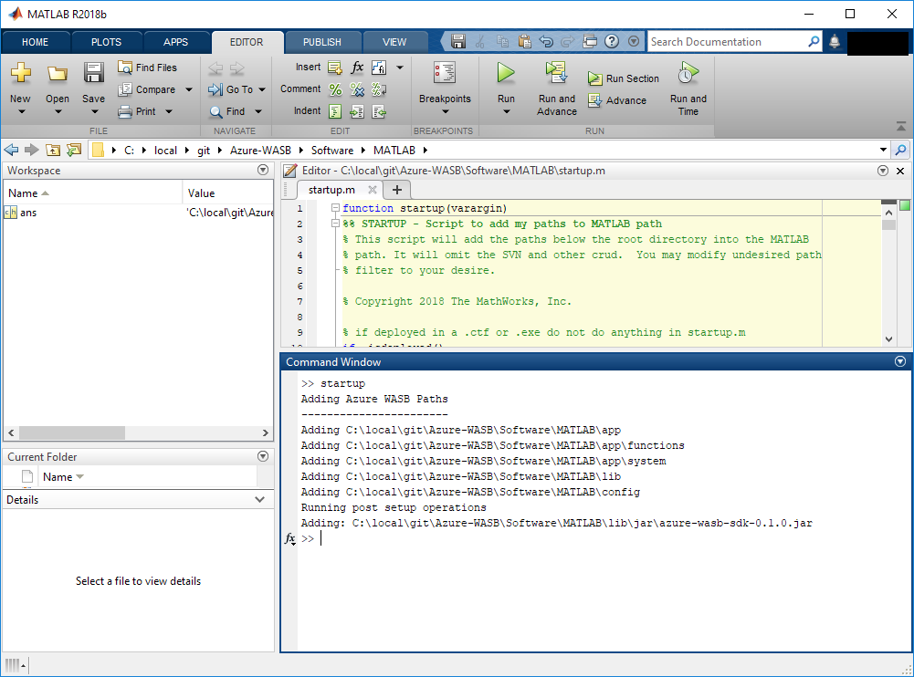

# Installation

## Installing on Windows®, macOS® and Linux

If installing based on a source code only, e.g. from GitHub then one must first build required jar files. Instructions to do can be found here: [Rebuild](Rebuild.md). Once built the package is installed as follows.

Copy the contents of the package to your desired location. Then from within MATLAB® change directory to that location and then to the Software/MATLAB subdirectory and run the *startup.m* file. This updates the relevant paths. One should see output similar to the following:

The package is now ready for use. One can configure MATLAB to call startup.m on startup if you wish so that the package is always available automatically. For further details see: [https://www.mathworks.com/help/matlab/ref/startup.html](https://www.mathworks.com/help/matlab/ref/startup.html)

----------------

[//]: #  (Copyright 2017, The MathWorks, Inc.)
