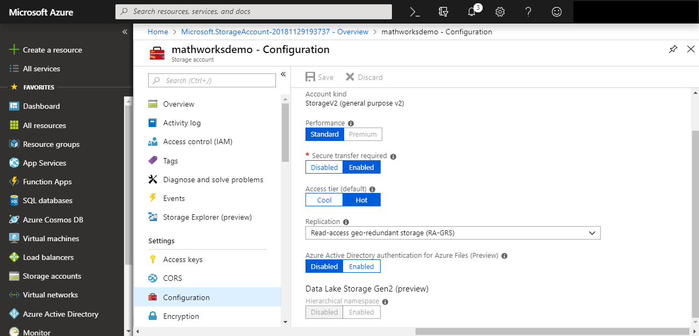

# Notes

## FAQ
A common error when first connecting is:
```
The account being accessed does not support http
```
This is most likely a result of the Azure™ configuration requiring secure transfer i.e. https.
One can either disable the requirement by Azure, which may not be desirable or switch to using secure transfer:



Used with permission from Microsoft®.

```
>> az.DefaultEndpointsProtocol = 'https';
```

## Storage Explorer

AzureStorageExplorer() invokes the Azure Storage Explorer application. It is possible to specify the local installation of the storage explorer in the configuration file.

##  Azure Shell

AzureShell() invokes the Azure Web Browser based shell this enables access to a browser-based command-line experience with Azure. It is an interactive, browser-accessible shell for managing Azure resources. The shell can be Bash or PowerShell™. The system configured browser is used. Authentication will be requested if not already in place within the browser.

## References:

[How to use blob-storage](https://docs.microsoft.com/en-us/azure/storage/storage-java-how-to-use-blob-storage)

[Connecting to Azure with Datastore](https://uk.mathworks.com/help/matlab/import_export/read-remote-data.html)


----------------

[//]: #  (Copyright 2017, The MathWorks, Inc.)
